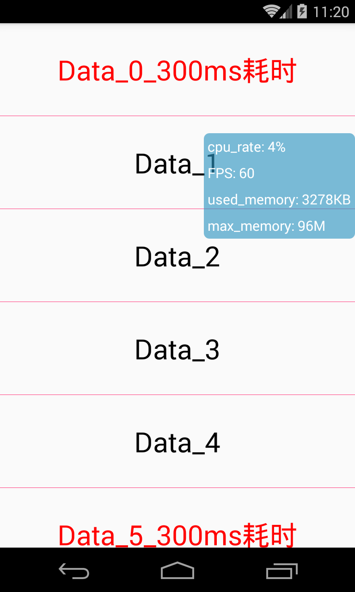

### 是什么

UIPerformance用于监控APP性能，并以悬浮窗的形式展示性能参数：

* FPS 帧率
* CPU占用率
* 内存使用


特性：

* 代码中，默认采样周期为300ms
* 悬浮窗在非UI线程进行绘制，不会影响主线程的检测
* 代码目前还不支持配置，只能是使用默认配置


TODO：

* 监控页面的启动时间
* 支持扩展


 


### 使用

只需在Application中加入如下代码，对现有代码的侵入性小

```
public class UIPerformanceApplication extends Application {

    @Override
    public void onCreate() {
        super.onCreate();
        //引入UI监控
        UIPerformance.getInstance(this).start();
    }
}
```

